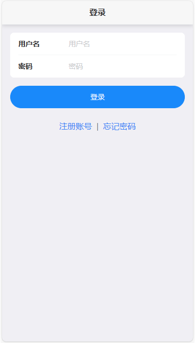

## 简介

IM 即时聊天系统demo的前端，实现了单聊、群聊、表情发送、图片发送、语音发送。

## 使用的技术栈
* vue+vite
* js
* vant
* tailwindcss
* daisyUI
*

## 配置文件
* .env.development
```yaml
# 变量必须以 VITE_ 为前缀才能暴露给外部读取
ENV = 'development'
# 网页标题
VITE_APP_TITLE = 'chat'
# 接口前缀
VITE_APP_BASE_API = '/api'
# 后端地址
VITE_BASE_PATH ='http://127.0.0.1'
# 后端端口
VITE_SERVER_PORT = 8081
```

## 项目运行
* 下载依赖
```bash
pnpm install
```

* 运行
```bash
pnpm dev
```

## 运行效果




